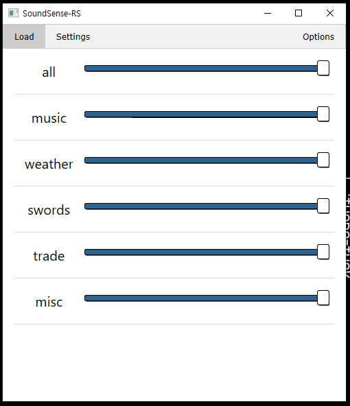
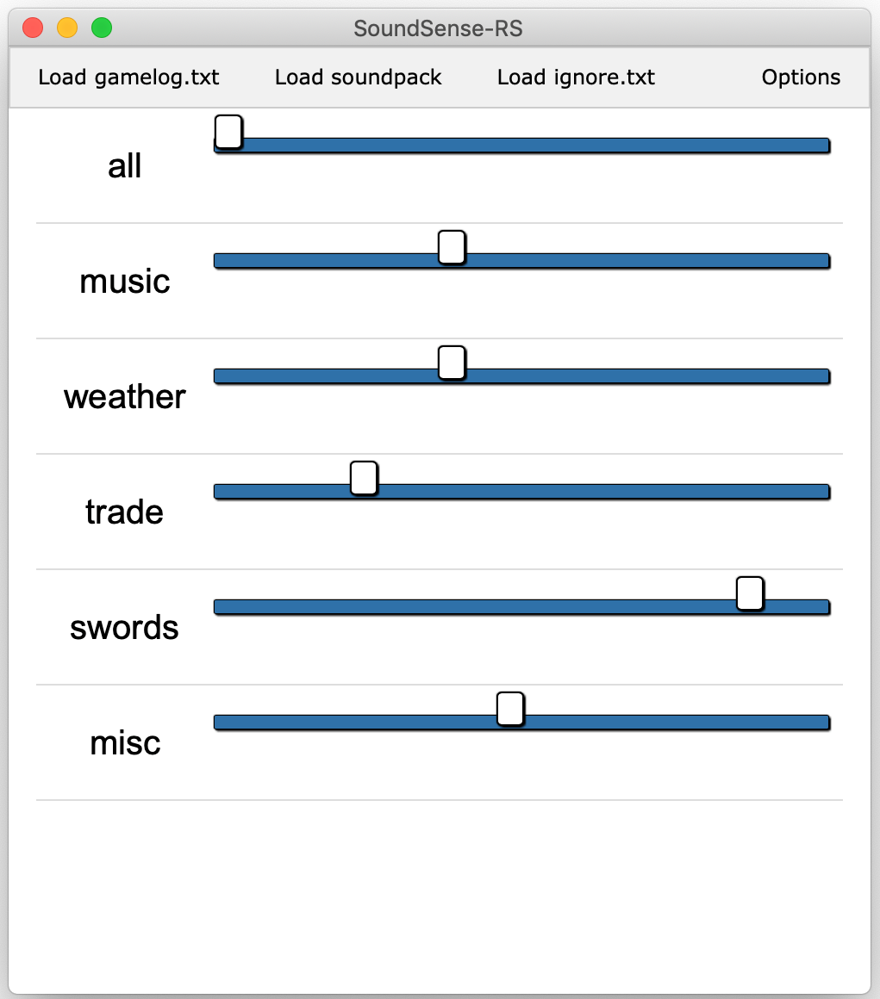
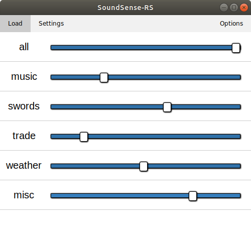

# SOUNDSENSE-RS</br></img></br>Soundsense, written in Rust.</br>
My attempt at recreating [SoundSense](http://df.zweistein.cz/soundsense/), a sound-engine utility for [Dwarf Fortress](http://www.bay12games.com/dwarves/), using Rust.

<p align='center'>
    
    
    
</p>

## Why?
1. To see if I could do it.
2. Attempt to create a standalone application that doesn't require bloat.
   * Ultimately, you should only need one executable, the soundpack folder, and DF.
   * Recommended soundpack fork: https://github.com/jecowa/soundsensepack

## Current Features
* Plays sounds reactive to what happens in DF.
* Can adjust sound volumes realtime, by channel.
* Skip and pause sound loops, by channel.
* Supports most sound parameters used by the original Soundsense (stereo balance, random balance, etc.)
* Custom ignore list, allowing user to customize which log patterns to ignore.
* Additional soundpack parameters. (Channel Settings)
* Simple and Clean GUI.
* Low memory requirement.

## Command line arguments
* __-l / --gamelog [GAMELOG_FILE] :__ preload the gamelog _(default: ".\gamelog.txt")_
* __-p / --soundpack [PACK_DIR] :__ preload the soundpack _(default: ".\soundpack")_
* __-i / --ignore [IGNORE_FILE] :__ preload the ignore list _(default: ".\ignore.txt")_
* __--no-config :__ Don't read config files on start. Will use the given paths, or soundsense-rs defaults.

Example:
```
soundsense-rs.exe -l "path/to/gamelog.txt" -p "path/to/soundpack/folder"
```
This will make soundsense-rs check if there is a file named "ignore.txt" in the current working directory, and will use that file to make the ignore list.

## Ignore List
Each line in the ignore list file is considered a regex pattern. If a gamelog message matches any of the patterns, that message is ignored.

Example:
```
(.+) cancels (.+): (.*)(Water|water)(.*)\.
```
This pattern will make soundsense-rs ignore any cancellations related to water.

The regex pattern uses the [regex crate](https://docs.rs/regex/) syntax.

## Logging
You can set the following environment variables to set the logging parameters. (Disabled on Windows releases)
* __SOUNDSENSE_RS_LOG__: set the level of logging. _(trace, debug, info, warn, error; default: warn)_
* __SOUNDSENSE_RS_LOG_STYLE__: set the level of the log style. _(always, auto, never; default: auto)_

## Channel Settings
[Read about it here.](./about_channel_setting.md)

## Dependencies
__Linux__: libasound2, libgtk-3, libgdk-3, libwebkit2gtk-4.0, libjavascriptcregtk-4.0

## MIT License
[Read it here.](./LICENSE)

## CSS Resources
* [W3.CSS](https://www.w3schools.com/w3css/)
* [range.css](http://danielstern.ca/range.css/#/)
